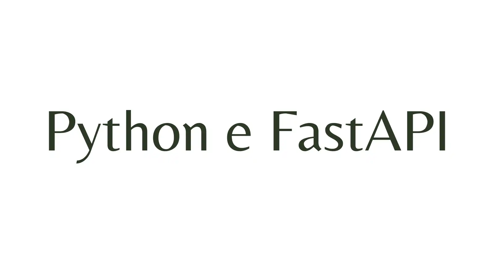

<br>

[](https://github.com/natorsc/python-fastapi "Ir para o repositório.")
&emsp;
[](https://github.com/natorsc/python-fastapi)
&emsp;
[](https://github.com/natorsc/python-fastapi)

[](https://github.com/natorsc/python-fastapi)

# Criando APIs com Python e FastAPI

## 📝 Descrição

Repositório criado para documentar e centralizar conteúdos, dicas, tutoriais e exemplos de código sobre a construção de APIs com a linguagem de programação Python e o framework web FastAPI.

---

## 🛠 Tecnologias utilizadas

Até o presente momento as seguintes tecnologias estão sendo utilizadas na construção do projeto:

[](https://www.python.org/ "Ir para o site.")
&emsp;
[](https://pypi.org/project/fastapi/ "Ir para o PyPi.")
&emsp;
[](https://pypi.org/project/SQLAlchemy/ "Ir para o PyPi.")
&emsp;
[](https://pypi.org/project/alembic/ "Ir para o PyPi.")

---

## 🤓 Autor

Feito com 💙 por [Renato Cruz](https://github.com/natorsc) 🤜🤛 Entre em contato!

[](mailto:zkpcvm6dz@mozmail.com "Enviar e-mail.")
&emsp;
[](https://www.linkedin.com/in/natorsc "Entre em contato.")

Uma das playlist que costumo ouvir quando estou estudando ou "codando" 😁:

[](https://open.spotify.com/playlist/1xf3u29puXlnrWO7MsaHL5?si=A-LgwRJXSvOno_e6trpi5w&utm_source=copy-link "Acessar playlist.")

Sempre que possível escrevo tutoriais no meu blog pessoal 🚀:

[](https://blog.codigoninja.dev/ "Ir para o blog.")

---

## 💝 Doações

### Ko-Fi

[](https://ko-fi.com/natorsc "Ajude com uma doação.")

### Pix


**Chave**: `b1839493-2afe-484d-9272-82a3e402b36f`

---

## Como executar o projeto

```bash
git clone git@github.com:natorsc/python-fastapi.git
```

```bash
poetry install
```

```bash
poetry shell
```

```bash
python contrib/initial_confg_generator.py
```

```bash
python runserver.py
```

ou

```bash
./runserver.sh
```

## 🎓 Tutoriais

- [Blog - serie sobre FastAPI](https://blog.justcode.com.br/series/python-e-fastapi).

---

## 🔗 Links uteis

### Documentação

- [FastAPI](https://fastapi.tiangolo.com/).
- [Starlette](https://www.starlette.io/).
- [SQLAlchemy](https://www.sqlalchemy.org/).
- [Alembic](https://alembic.sqlalchemy.org/en/latest/).
- [Swagger](https://swagger.io/).
- [Redoc](https://github.com/Redocly/redoc). 

---

## Softwares

### Banco de dados

- [DB Browser for SQLite](https://sqlitebrowser.org/).
- [DBeaver](https://dbeaver.io/download/).

### Clientes para API

#### Desktop

- [insomnia](https://insomnia.rest/download).
    - [Flathub](https://flathub.org/apps/details/rest.insomnia.Insomnia).
- [Postman](https://www.postman.com/).
    - [Flathub](https://flathub.org/apps/details/com.getpostman.Postman).
- [GetIt](https://flathub.org/apps/details/net.bartkessels.getit).

#### Google Chrome

- [Talend API Tester - Free Edition](https://chrome.google.com/webstore/detail/talend-api-tester-free-ed/aejoelaoggembcahagimdiliamlcdmfm?hl=pt-br).
- [Advanced REST client](https://chrome.google.com/webstore/detail/advanced-rest-client/hgmloofddffdnphfgcellkdfbfbjeloo?hl=pt-BR).

#### Firefox

- [REST Client APIsHub](https://addons.mozilla.org/pt-BR/firefox/addon/rest-client-apishub/?utm_source=addons.mozilla.org&utm_medium=referral&utm_content=search).
- [RESTED](https://addons.mozilla.org/pt-BR/firefox/addon/rested/?utm_source=addons.mozilla.org&utm_medium=referral&utm_content=search).
- [RESTer](https://addons.mozilla.org/pt-BR/firefox/addon/rester/?utm_source=addons.mozilla.org&utm_medium=referral&utm_content=search).

---

## 💡 Extra

### Poetry

#### requirements.txt

Para gerar o arquivo de dependências `requirements.txt` através do [Poetry](https://python-poetry.org/) utilizar o comando:

```bash
poetry export \
--without-hashes \
-f requirements.txt \
-o requirements.txt
```

#### requirements-dev.txt

Para gerar um arquivo que possua também as dependências de desenvolvimento (`requirements-dev.txt`):

```bash
poetry export \
--dev \
--without-hashes \
-f requirements.txt \
-o requirements-dev.txt
```

---
